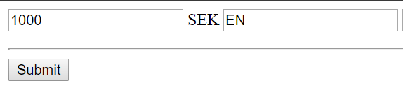
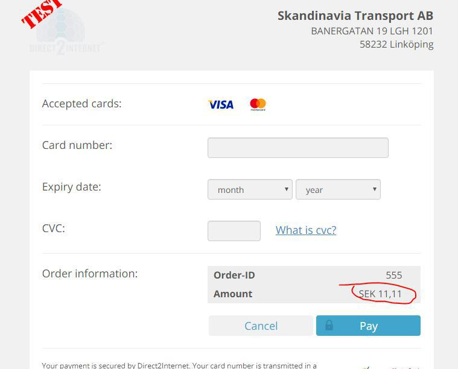
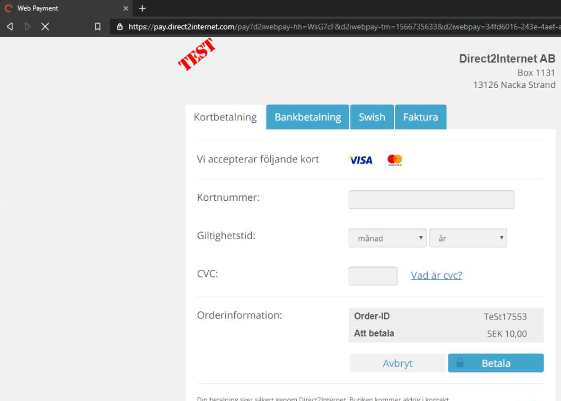

# Direct2Internet Payment

## How we can use direct2internet API? 

A repository to write a program to connect to direct2internet payment page.

Target: https://pay.direct2internet.com/pay/test

-----------

## Based On

- [jQuery 3.4.1](https://ajax.googleapis.com/ajax/libs/jquery/3.4.1/jquery.min.js)
- [SHA256 Hash Generator JS](https://github.com/BaseMax/SHA256HashGeneratorJS)

## References

- http://www.direct2internet.com
- https://www.direct2internet.com/psp-paywin-api/
- https://www.direct2internet.com/mac-calculator/
- http://www.direct2internet.com/testa-checkout/
- http://www.direct2internet.com/plugin-e-handel/
- http://www.direct2internet.com/egen-psp/
- http://www.direct2internet.com/e-handel/
